# ImaginAIry 🤖🧠
[](https://pepy.tech/project/imaginairy)
[](https://pypi.org/project/imaginairy/)
[](https://github.com/brycedrennan/imaginAIry/blob/master/LICENSE/)
[](https://github.com/ambv/black)
[](https://github.com/brycedrennan/imaginAIry/actions/workflows/ci.yaml)

AI imagined images. Pythonic generation of stable diffusion images.

"just works" on Linux and macOS(M1) (and maybe windows?).

## Examples
```bash
# on macOS, make sure rust is installed first
>> pip install imaginairy
>> imagine "a scenic landscape" "a photo of a dog" "photo of a fruit bowl" "portrait photo of a freckled woman"
# Stable Diffusion 2.1
>> imagine --model SD-2.1 "a forest"
# Make generation gif
>> imagine --gif "a flower"

```

<details closed>
<summary>Console Output</summary>

```bash
🤖🧠 received 4 prompt(s) and will repeat them 1 times to create 4 images.
Loading model onto mps backend...
Generating 🖼  : "a scenic landscape" 512x512px seed:557988237 prompt-strength:7.5 steps:40 sampler-type:PLMS
    PLMS Sampler: 100%|████████████████████████████████████████████████████████████████████████████████████████████████████████████████████████████| 40/40 [00:29<00:00,  1.36it/s]
    🖼  saved to: ./outputs/000001_557988237_PLMS40_PS7.5_a_scenic_landscape.jpg
Generating 🖼  : "a photo of a dog" 512x512px seed:277230171 prompt-strength:7.5 steps:40 sampler-type:PLMS
    PLMS Sampler: 100%|████████████████████████████████████████████████████████████████████████████████████████████████████████████████████████████| 40/40 [00:28<00:00,  1.41it/s]
    🖼  saved to: ./outputs/000002_277230171_PLMS40_PS7.5_a_photo_of_a_dog.jpg
Generating 🖼  : "photo of a fruit bowl" 512x512px seed:639753980 prompt-strength:7.5 steps:40 sampler-type:PLMS
    PLMS Sampler: 100%|████████████████████████████████████████████████████████████████████████████████████████████████████████████████████████████| 40/40 [00:28<00:00,  1.40it/s]
    🖼  saved to: ./outputs/000003_639753980_PLMS40_PS7.5_photo_of_a_fruit_bowl.jpg
Generating 🖼  : "portrait photo of a freckled woman" 512x512px seed:500686645 prompt-strength:7.5 steps:40 sampler-type:PLMS
    PLMS Sampler: 100%|████████████████████████████████████████████████████████████████████████████████████████████████████████████████████████████| 40/40 [00:29<00:00,  1.37it/s]
    🖼  saved to: ./outputs/000004_500686645_PLMS40_PS7.5_portrait_photo_of_a_freckled_woman.jpg
```
</details>

<br>
<br>
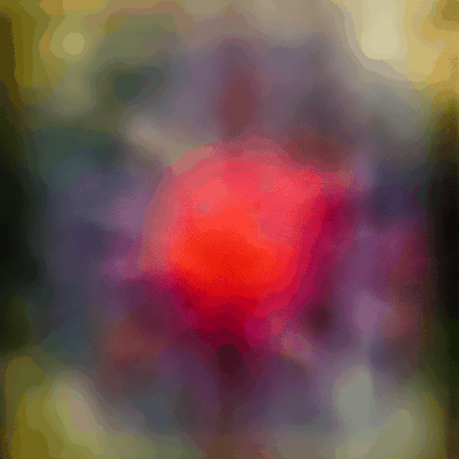


###  🎉 Edit Images with Instructions alone! [by InstructPix2Pix](https://github.com/timothybrooks/instruct-pix2pix)
Just tell imaginairy how to edit the image and it will do it for you!  
Use prompt strength to control how strong the edit is. For extra control you can combine
with prompt-based masking.

```bash
>> aimg edit scenic_landscape.jpg "make it winter" --prompt-strength 20
>> aimg edit scenic_landscape.jpg "make it winter" --steps 30 --arg-schedule "prompt_strength[2:25:0.5]" --compilation-anim
>> aimg edit dog.jpg "make the dog red" --prompt-strength 5
>> aimg edit bowl_of_fruit.jpg "replace the fruit with strawberries"
>> aimg edit freckled_woman.jpg "make her a cyborg" --prompt-strength 13
# create a comparison gif
>> aimg edit pearl_girl.jpg "make her wear clown makeup" --compare-gif
# create an animation showing the edit with increasing prompt strengths
>> aimg edit mona-lisa.jpg "make it a color professional photo headshot" --negative-prompt "old, ugly, blurry" --arg-schedule "prompt-strength[2:8:0.5]" --compilation-anim gif
```


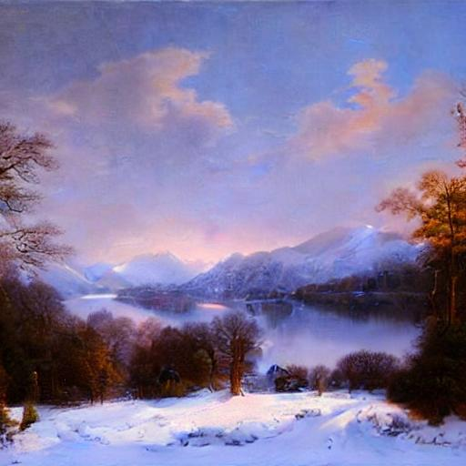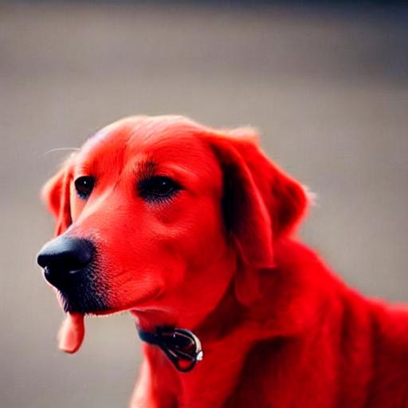<br>
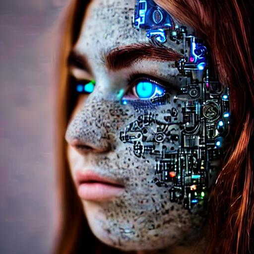<br>
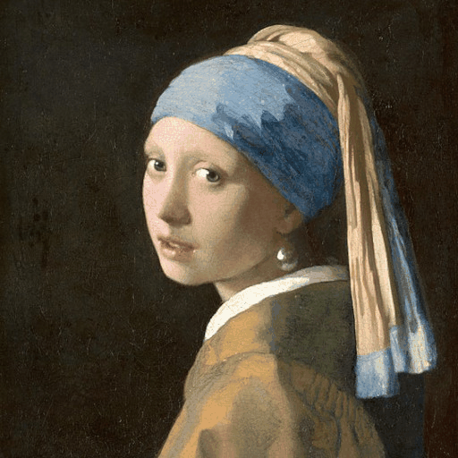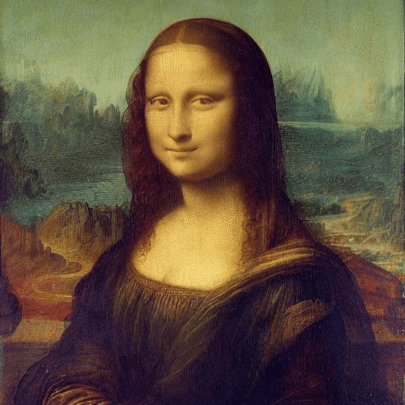<br>

Want just quickly have some fun? Try `edit-demo` to apply some pre-defined edits.
```bash
>> aimg edit-demo pearl_girl.jpg
>> aimg edit-demo mona-lisa.jpg
>> aimg edit-demo luke.jpg
>> aimg edit-demo spock.jpg
```
<br>
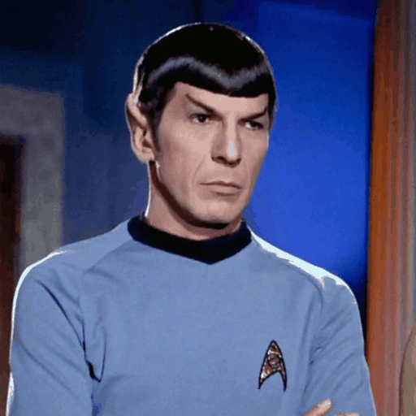<br>
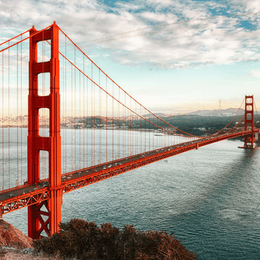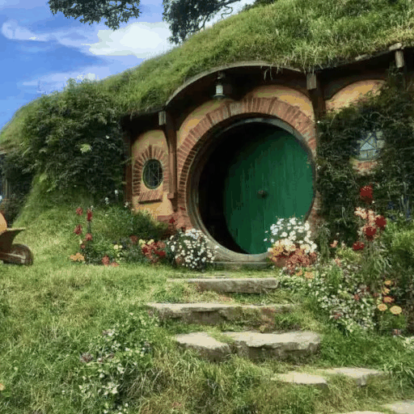<br>


### Prompt Based Masking  [by clipseg](https://github.com/timojl/clipseg)
Specify advanced text based masks using boolean logic and strength modifiers. 
Mask syntax:
  - mask descriptions must be lowercase
  - keywords (`AND`, `OR`, `NOT`) must be uppercase
  - parentheses are supported 
  - mask modifiers may be appended to any mask or group of masks.  Example: `(dog OR cat){+5}` means that we'll
select any dog or cat and then expand the size of the mask area by 5 pixels.  Valid mask modifiers:
    - `{+n}` - expand mask by n pixels
    - `{-n}` - shrink mask by n pixels
    - `{*n}` - multiply mask strength. will expand mask to areas that weakly matched the mask description
    - `{/n}` - divide mask strength. will reduce mask to areas that most strongly matched the mask description. probably not useful

When writing strength modifiers keep in mind that pixel values are between 0 and 1.

```bash
>> imagine \
    --init-image pearl_earring.jpg \
    --mask-prompt "face AND NOT (bandana OR hair OR blue fabric){*6}" \
    --mask-mode keep \
    --init-image-strength .2 \
    --fix-faces \
    "a modern female president" "a female robot" "a female doctor" "a female firefighter"
```
➡️ 

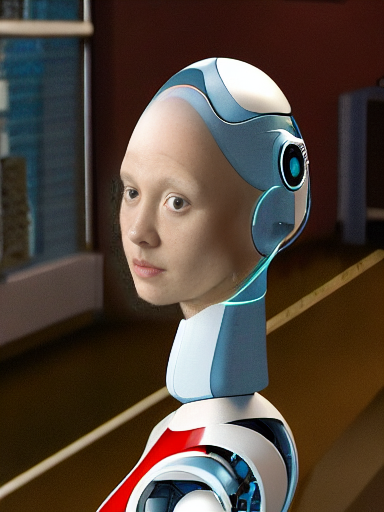
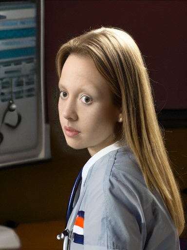
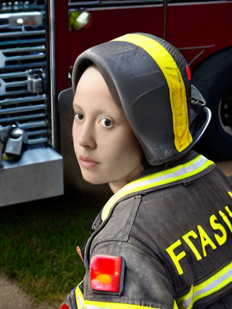

```bash
>> imagine \
    --init-image fruit-bowl.jpg \
    --mask-prompt "fruit OR fruit stem{*6}" \
    --mask-mode replace \
    --mask-modify-original \
    --init-image-strength .1 \
    "a bowl of kittens" "a bowl of gold coins" "a bowl of popcorn" "a bowl of spaghetti"
```
➡️ 


### Face Enhancement [by CodeFormer](https://github.com/sczhou/CodeFormer)

```bash
>> imagine "a couple smiling" --steps 40 --seed 1 --fix-faces
```
 ➡️ 
 


### Upscaling [by RealESRGAN](https://github.com/xinntao/Real-ESRGAN)
```bash
>> imagine "colorful smoke" --steps 40 --upscale
```
 ➡️ 
 

### Tiled Images
```bash
>> imagine  "gold coins" "a lush forest" "piles of old books" leaves --tile
```


<br>


#### 360 degree images
```bash
imagine --tile-x -w 1024 -h 512 "360 degree equirectangular panorama photograph of the desert"  --upscale
```
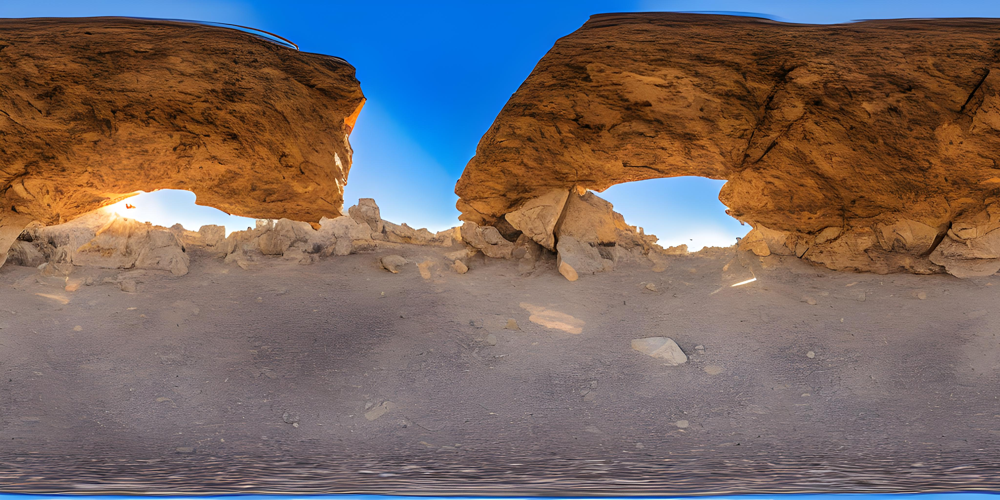

### Image-to-Image
Use depth maps for amazing "translations" of existing images.

```bash
>> imagine --model SD-2.0-depth --init-image girl_with_a_pearl_earring_large.jpg --init-image-strength 0.05  "professional headshot photo of a woman with a pearl earring" -r 4 -w 1024 -h 1024 --steps 50
```
 ➡️ 
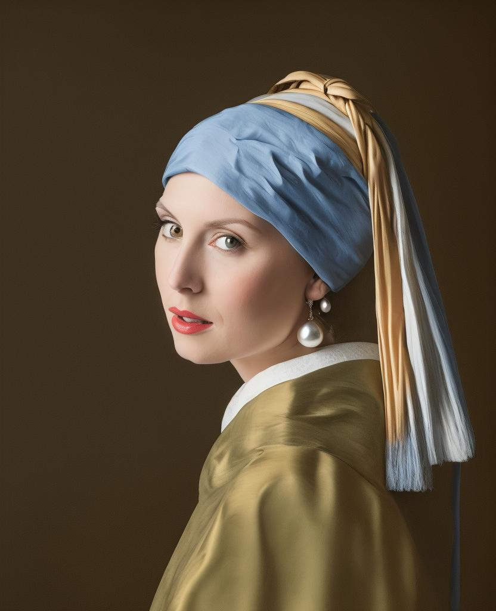
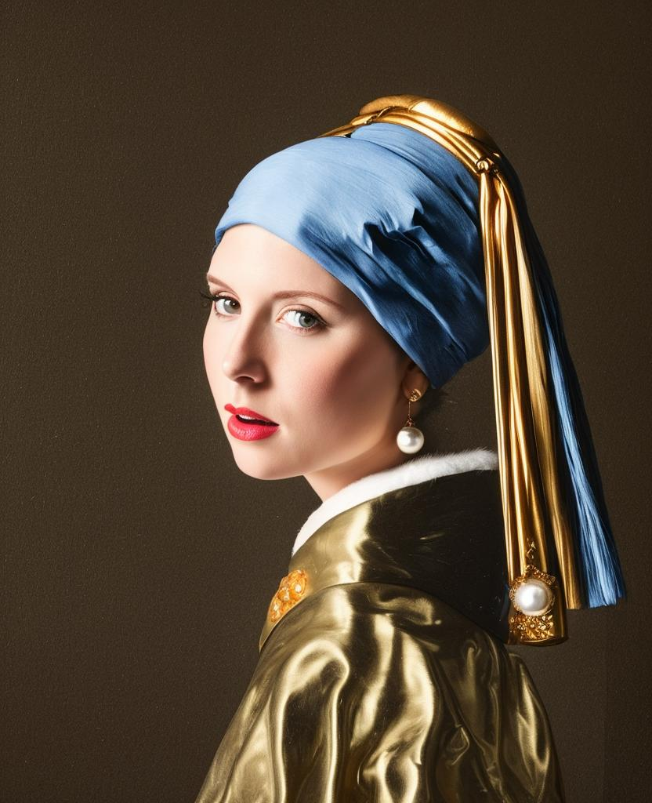 
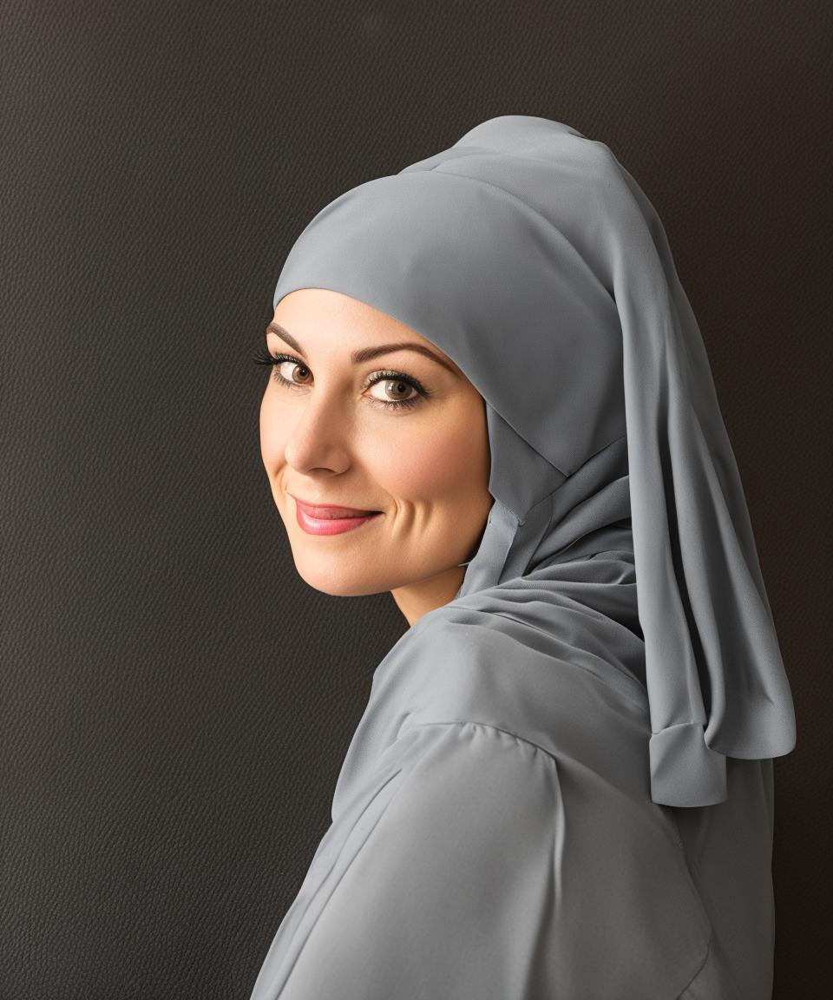


### Outpainting

Given a starting image, one can generate it's "surroundings".

Example:
`imagine --init-image pearl-earring.jpg --init-image-strength 0 --outpaint all250,up0,down600 "woman standing"`
 ➡️ 


### Prompt Expansion
You can use `{}` to randomly pull values from lists.  A list of values separated by `|` 
 and enclosed in `{ }` will be randomly drawn from in a non-repeating fashion. Values that are surrounded by `_ _` will 
 pull from a phrase list of the same name.   Folders containing .txt phraselist files may be specified via
`--prompt_library_path`. The option may be specified multiple times.  Built-in categories:
    
      3d-term, adj-architecture, adj-beauty, adj-detailed, adj-emotion, adj-general, adj-horror, animal, art-movement, 
      art-site, artist, artist-botanical, artist-surreal, aspect-ratio, bird, body-of-water, body-pose, camera-brand,
      camera-model, color, cosmic-galaxy, cosmic-nebula, cosmic-star, cosmic-term, dinosaur, eyecolor, f-stop, 
      fantasy-creature, fantasy-setting, fish, flower, focal-length, food, fruit, games, gen-modifier, hair, hd,
      iso-stop, landscape-type, national-park, nationality, neg-weight, noun-beauty, noun-fantasy, noun-general, 
      noun-horror, occupation, photo-term, pop-culture, pop-location, punk-style, quantity, rpg-item, scenario-desc, 
      skin-color, spaceship, style, tree-species, trippy, world-heritage-site

   Examples:

   `imagine "a {lime|blue|silver|aqua} colored dog" -r 4 --seed 0` (note that it generates a dog of each color without repetition)


   `imagine "a {_color_} dog" -r 4 --seed 0` will generate four, different colored dogs. The colors will be pulled from an included 
   phraselist of colors.
    
   `imagine "a {_spaceship_|_fruit_|hot air balloon}. low-poly" -r 4 --seed 0` will generate images of spaceships or fruits or a hot air balloon

   Credit to [noodle-soup-prompts](https://github.com/WASasquatch/noodle-soup-prompts/) where most, but not all, of the wordlists originate.

### Generate image captions (via [BLIP](https://github.com/salesforce/BLIP))
```bash
>> aimg describe assets/mask_examples/bowl001.jpg
a bowl full of gold bars sitting on a table
```

## Features
 
 - It makes images from text descriptions! 🎉
 - Generate images either in code or from command line.
 - It just works. Proper requirements are installed. model weights are automatically downloaded. No huggingface account needed. 
    (if you have the right hardware... and aren't on windows)
 - No more distorted faces!
 - Noisy logs are gone (which was surprisingly hard to accomplish)
 - WeightedPrompts let you smash together separate prompts (cat-dog)
 - Tile Mode creates tileable images
 - Prompt metadata saved into image file metadata
 - Edit images by describing the part you want edited (see example above)
 - Have AI generate captions for images `aimg describe <filename-or-url>`
 - Interactive prompt: just run `aimg`
 - 🎉 finetune your own image model. kind of like dreambooth. Read instructions on ["Concept Training"](docs/concept-training.md) page

## How To

For full command line instructions run `aimg --help`

```python
from imaginairy import imagine, imagine_image_files, ImaginePrompt, WeightedPrompt, LazyLoadingImage

url = "https://upload.wikimedia.org/wikipedia/commons/thumb/6/6c/Thomas_Cole_-_Architect%E2%80%99s_Dream_-_Google_Art_Project.jpg/540px-Thomas_Cole_-_Architect%E2%80%99s_Dream_-_Google_Art_Project.jpg"
prompts = [
    ImaginePrompt("a scenic landscape", seed=1, upscale=True),
    ImaginePrompt("a bowl of fruit"),
    ImaginePrompt([
        WeightedPrompt("cat", weight=1),
        WeightedPrompt("dog", weight=1),
    ]),
    ImaginePrompt(
        "a spacious building", 
        init_image=LazyLoadingImage(url=url)
    ),
    ImaginePrompt(
        "a bowl of strawberries", 
        init_image=LazyLoadingImage(filepath="mypath/to/bowl_of_fruit.jpg"),
        mask_prompt="fruit OR stem{*2}",  # amplify the stem mask x2
        mask_mode="replace",
        mask_modify_original=True,
    ),
    ImaginePrompt("strawberries", tile_mode=True),
]
for result in imagine(prompts):
    # do something
    result.save("my_image.jpg")

# or

imagine_image_files(prompts, outdir="./my-art")

```

## Requirements
- ~10 gb space for models to download
- A CUDA supported graphics card with >= 11gb VRAM (and CUDA installed) or an M1 processor.
- Python installed. Preferably Python 3.10.  (not conda)
- For macOS [rust](https://www.rust-lang.org/tools/install) and setuptools-rust must be installed to compile the `tokenizer` library.
They can be installed via: `curl --proto '=https' --tlsv1.2 -sSf https://sh.rustup.rs | sh` and `pip install setuptools-rust`
    

## Running in Docker
See example Dockerfile (works on machine where you can pass the gpu into the container)
```bash
docker build . -t imaginairy
# you really want to map the cache or you end up wasting a lot of time and space redownloading the model weights
docker run -it --gpus all -v $HOME/.cache/huggingface:/root/.cache/huggingface -v $HOME/.cache/torch:/root/.cache/torch -v `pwd`/outputs:/outputs imaginairy /bin/bash
```

## Running on Google Colab
[Example Colab](https://colab.research.google.com/drive/1rOvQNs0Cmn_yU1bKWjCOHzGVDgZkaTtO?usp=sharing)

## Q&A

**Q**: How do I change the cache directory for where models are stored?

**A**: Set the `HUGGINGFACE_HUB_CACHE` environment variable. 


## ChangeLog

- perf: cli now has minimal overhead such that `aimg --help` runs in ~650ms instead of ~3400ms
- feature: `edit` and `imagine` commands now accept multiple images (which they will process separately).  This allows 
batch editing of images as requested in [#229](https://github.com/brycedrennan/imaginAIry/issues/229)
- refactor: move `--surprise-me` to its own subcommand `edit-demo`
- feature: allow selection of output image format with `--output-file-extension`
- docs: make training fail on MPS platform with useful error message
- docs: add directions on how to change model cache path

**8.3.1**
- fix: init-image-strength type

**8.3.0**
- feature: create `gifs` or `mp4s` from any images made in a single run with `--compilation-anim gif`
- feature: create a series of images or edits by iterating over a parameter with the `--arg-schedule` argument
- feature: `openjourney-v1` and `openjourney-v2` models added. available via `--model openjourney-v2`
- feature: add upscale command line function: `aimg upscale`
- feature: `--gif` option will create a gif showing the generation process for a single image
- feature: `--compare-gif` option will create a comparison gif for any image edits
- fix: tile mode was broken since latest perf improvements

**8.2.0**
- feature: added `aimg system-info` command to help debug issues

**8.1.0**
- feature: some memory optimizations and documentation
- feature: surprise-me improvements
- feature: image sizes can now be multiples of 8 instead of 64. Inputs will be silently rounded down.
- feature: cleaned up `aimg` shell logs  
- feature: auto-regen for unsafe images
- fix: make blip filename windows compatible
- fix: make captioning work with alpha pngs
 
**8.0.5**
- fix: bypass huggingface cache retrieval bug

**8.0.4**
- fix: limit attention slice size on MacOS machines with 64gb (#175)

**8.0.3**
- fix: use python 3.7 compatible lru_cache
- fix: use windows compatible filenames

**8.0.2**
- fix: hf_hub_download() got an unexpected keyword argument 'token'

**8.0.1**
- fix: spelling mistake of "surprise"

**8.0.0**
- feature: 🎉 edit images with instructions alone!
- feature: when editing an image add `--gif` to create a comparision gif
- feature: `aimg edit --surprise-me --gif my-image.jpg` for some fun pre-programmed edits
- feature: prune-ckpt command also removes the non-ema weights

**7.6.0**
- fix: default model config was broken
- feature: print version with `--version`
- feature: ability to load safetensors
- feature:  🎉 outpainting. Examples: `--outpaint up10,down300,left50,right50` or `--outpaint all100` or `--outpaint u100,d200,l300,r400`

**7.4.3**
- fix: handle old pytorch lightning imports with a graceful failure (fixes #161)
- fix: handle failed image generations better (fixes #83)

**7.4.2**
- fix: run face enhancement on GPU for 10x speedup

**7.4.1**
- fix: incorrect config files being used for non-1.0 models

**7.4.0**
- feature: 🎉 finetune your own image model. kind of like dreambooth. Read instructions on ["Concept Training"](docs/concept-training.md) page
- feature: image prep command. crops to face or other interesting parts of photo
- fix: back-compat for hf_hub_download
- feature: add prune-ckpt command
- feature: allow specification of model config file

**7.3.0**
- feature: 🎉 depth-based image-to-image generations (and inpainting) 
- fix: k_euler_a produces more consistent images per seed (randomization respects the seed again)

**7.2.0**
- feature: 🎉 tile in a single dimension ("x" or "y").  This enables, with a bit of luck, generation of 360 VR images.
Try this for example: `imagine --tile-x -w 1024 -h 512 "360 degree equirectangular panorama photograph of the mountains"  --upscale`

**7.1.1**
- fix: memory/speed regression introduced in 6.1.0
- fix: model switching now clears memory better, thus avoiding out of memory errors

**7.1.0**
- feature: 🎉 Stable Diffusion 2.1.  Generated people are no longer (completely) distorted. 
Use with `--model SD-2.1` or `--model SD-2.0-v` 

**7.0.0**
- feature: negative prompting.  `--negative-prompt` or `ImaginePrompt(..., negative_prompt="ugly, deformed, extra arms, etc")`
- feature: a default negative prompt is added to all generations. Images in SD-2.0 don't look bad anymore. Images in 1.5 look improved as well.

**6.1.2**
- fix: add back in memory-efficient algorithms

**6.1.1**
- feature: xformers will be used if available (for faster generation)
- fix: version metadata was broken

**6.1.0**
- feature: use different default steps and image sizes depending on sampler and model selceted
- fix: #110 use proper version in image metadata
- refactor: samplers all have their own class that inherits from ImageSampler
- feature: 🎉🎉🎉 Stable Diffusion 2.0
  - `--model SD-2.0` to use (it makes worse images than 1.5 though...) 
  - Tested on macOS and Linux
  - All samplers working for new 512x512 model
  - New inpainting model working
  - 768x768 model working for all samplers except PLMS (`--model SD-2.0-v `)

**5.1.0**
- feature: add progress image callback

**5.0.1**
- fix: support larger images on M1. Fixes #8
- fix: support CPU generation by disabling autocast on CPU. Fixes #81

**5.0.0**
- feature: 🎉 inpainting support using new inpainting model from RunwayML. It works really well! By default, the 
inpainting model will automatically be used for any image-masking task 
- feature: 🎉 new default sampler makes image generation more than twice as fast
- feature: added `DPM++ 2S a` and `DPM++ 2M` samplers.
- feature: improve progress image logging
- fix: fix bug with `--show-work`. fixes #84
- fix: add workaround for pytorch bug affecting macOS users using the new `DPM++ 2S a` and `DPM++ 2M` samplers.
- fix: add workaround for pytorch mps bug affecting `k_dpm_fast` sampler. fixes #75
- fix: larger image sizes now work on macOS. fixes #8

**4.1.0**
 - feature: allow dynamic switching between models/weights `--model SD-1.5` or `--model SD-1.4` or `--model path/my-custom-weights.ckpt`)
 - feature: log total progress when generating images (image X out of Y)

**4.0.0**
 - feature: stable diffusion 1.5 (slightly improved image quality)
 - feature: dilation and erosion of masks
 Previously the `+` and `-` characters in a mask (example: `face{+0.1}`) added to the grayscale value of any masked areas. This wasn't very useful. The new behavior is that the mask will expand or contract by the number of pixel specified. The technical terms for this are dilation and erosion.  This allows much greater control over the masked area.
 - feature: update k-diffusion samplers. add k_dpm_adaptive and k_dpm_fast
 - feature: img2img/inpainting supported on all samplers
 - refactor: consolidates img2img/txt2img code. consolidates schedules. consolidates masking
 - ci: minor logging improvements

**3.0.1**
 - fix: k-samplers were broken

**3.0.0**
 - feature: improved safety filter

**2.4.0**
 - 🎉 feature: prompt expansion
 - feature: make (blip) photo captions more descriptive

**2.3.1**
 - fix: face fidelity default was broken

**2.3.0**
 - feature: model weights file can be specified via `--model-weights-path` argument at the command line
 - fix: set face fidelity default back to old value
 - fix: handle small images without throwing exception. credit to @NiclasEriksen
 - docs: add setuptools-rust as dependency for macos 

**2.2.1**
 - fix: init image is fully ignored if init-image-strength = 0

**2.2.0**
 - feature: face enhancement fidelity is now configurable

**2.1.0**
 - [improved masking accuracy from clipseg](https://github.com/timojl/clipseg/issues/8#issuecomment-1259150865)

**2.0.3**
 - fix memory leak in face enhancer
 - fix blurry inpainting 
 - fix for pillow compatibility

**2.0.0**
 - 🎉 fix: inpainted areas correlate with surrounding image, even at 100% generation strength.  Previously if the generation strength was high enough the generated image
would be uncorrelated to the rest of the surrounding image.  It created terrible looking images.   
 - 🎉 feature: interactive prompt added. access by running `aimg`
 - 🎉 feature: Specify advanced text based masks using boolean logic and strength modifiers. Mask descriptions must be lowercase. Keywords uppercase.
   Valid symbols: `AND`, `OR`, `NOT`, `()`, and mask strength modifier `{+0.1}` where `+` can be any of `+ - * /`. Single character boolean operators also work (`|`, `&`, `!`)
 - 🎉 feature: apply mask edits to original files with `mask_modify_original` (on by default)
 - feature: auto-rotate images if exif data specifies to do so
 - fix: mask boundaries are more accurate
 - fix: accept mask images in command line
 - fix: img2img algorithm was wrong and wouldn't at values close to 0 or 1

**1.6.2**
 - fix: another bfloat16 fix

**1.6.1**
 - fix: make sure image tensors come to the CPU as float32 so there aren't compatibility issues with non-bfloat16 cpus

**1.6.0**
 - fix: *maybe* address #13 with `expected scalar type BFloat16 but found Float`
   - at minimum one can specify `--precision full` now and that will probably fix the issue  
 - feature: tile mode can now be specified per-prompt

**1.5.3**
 - fix: missing config file for describe feature

**1.5.1**
 - img2img now supported with PLMS (instead of just DDIM)
 - added image captioning feature `aimg describe dog.jpg` => `a brown dog sitting on grass`
 - added new commandline tool `aimg` for additional image manipulation functionality

**1.4.0**
 - support multiple additive targets for masking with `|` symbol.  Example: "fruit|stem|fruit stem"

**1.3.0**
 - added prompt based image editing. Example: "fruit => gold coins"
 - test coverage improved

**1.2.0**
 - allow urls as init-images

**previous**
 - img2img actually does # of steps you specify  
 - performance optimizations
 - numerous other changes


## Not Supported
 - a GUI. this is a python library
 - exploratory features that don't work well

## Todo

 - Performance Optimizations
   - ✅ fp16
   - ✅ [Doggettx Sliced attention](https://github.com/CompVis/stable-diffusion/compare/main...Doggettx:stable-diffusion:autocast-improvements#)
   - ✅ xformers support https://www.photoroom.com/tech/stable-diffusion-100-percent-faster-with-memory-efficient-attention/
   - https://github.com/neonsecret/stable-diffusion  
   - https://github.com/CompVis/stable-diffusion/pull/177
   - https://github.com/huggingface/diffusers/pull/532/files
   - https://github.com/HazyResearch/flash-attention
   
 - Development Environment
   - ✅ add tests
   - ✅ set up ci (test/lint/format)
   - ✅ unified pipeline (txt2img & img2img combined)
   - ✅ setup parallel testing
   - add docs
   - remove yaml config
   - delete more unused code
   - faster latent logging https://discuss.huggingface.co/t/decoding-latents-to-rgb-without-upscaling/23204/9
 - Interface improvements
   - ✅ init-image at command line
   - ✅ prompt expansion
   - ✅ interactive cli
 - Image Generation Features
   - ✅ add k-diffusion sampling methods
   - ✅ tiling
   - generation videos/gifs
   - Compositional Visual Generation
     - https://github.com/energy-based-model/Compositional-Visual-Generation-with-Composable-Diffusion-Models-PyTorch
     - https://colab.research.google.com/github/energy-based-model/Compositional-Visual-Generation-with-Composable-Diffusion-Models-PyTorch/blob/main/notebooks/demo.ipynb#scrollTo=wt_j3uXZGFAS
   - ✅ negative prompting
     - some syntax to allow it in a text string
   - 🚫 images as actual prompts instead of just init images. 
     - not directly possible due to model architecture.
     - requires model fine-tuning since SD1.4 expects 77x768 text encoding input
     - https://twitter.com/Buntworthy/status/1566744186153484288
     - https://github.com/justinpinkney/stable-diffusion
     - https://github.com/LambdaLabsML/lambda-diffusers
     - https://www.reddit.com/r/MachineLearning/comments/x6k5bm/n_stable_diffusion_image_variations_released/
 - Image Editing
   - ✅outpainting
     - https://github.com/parlance-zz/g-diffuser-bot/search?q=noise&type=issues
     - lama cleaner
   - ✅ inpainting
     - https://github.com/Jack000/glid-3-xl-stable 
     - https://github.com/andreas128/RePaint
     - ✅ img2img but keeps img stable
     - https://www.reddit.com/r/StableDiffusion/comments/xboy90/a_better_way_of_doing_img2img_by_finding_the/
     - https://gist.github.com/trygvebw/c71334dd127d537a15e9d59790f7f5e1
     - https://github.com/pesser/stable-diffusion/commit/bbb52981460707963e2a62160890d7ecbce00e79
     - https://github.com/SHI-Labs/FcF-Inpainting https://praeclarumjj3.github.io/fcf-inpainting/
   - ✅ text based image masking
     - ✅ ClipSeg - https://github.com/timojl/clipseg
     - https://github.com/facebookresearch/detectron2
   - Attention Control Methods
     - https://github.com/bloc97/CrossAttentionControl
     - https://github.com/ChenWu98/cycle-diffusion
 - Image Enhancement
   - Photo Restoration - https://github.com/microsoft/Bringing-Old-Photos-Back-to-Life
   - Upscaling
     - ✅ realesrgan 
     - ldm
     - https://github.com/lowfuel/progrock-stable
     - gobig
     - stable super-res?
       - todo: try with 1-0-0-0 mask at full image resolution (rencoding entire image+predicted image at every step)
       - todo: use a gaussian pyramid and only include the "high-detail" level of the pyramid into the next step
       - https://www.reddit.com/r/StableDiffusion/comments/xkjjf9/upscale_to_huge_sizes_and_add_detail_with_sd/
   - ✅ face enhancers
     - ✅ gfpgan - https://github.com/TencentARC/GFPGAN
     - ✅ codeformer - https://github.com/sczhou/CodeFormer
   - ✅ image describe feature - 
     - ✅ https://github.com/salesforce/BLIP
     - 🚫 CLIP brute-force prompt reconstruction
       - The accuracy of this approach is too low for me to include it in imaginAIry
       - https://github.com/rmokady/CLIP_prefix_caption
       - https://github.com/pharmapsychotic/clip-interrogator (blip + clip)
     - https://github.com/KaiyangZhou/CoOp
   - 🚫 CPU support.  While the code does actually work on some CPUs, the generation takes so long that I don't think it's
    worth the effort to support this feature
   - ✅ img2img for plms
   - ✅ img2img for kdiff functions
 - Other
   - Enhancement pipelines
   - text-to-3d https://dreamfusionpaper.github.io/
     - https://shihmengli.github.io/3D-Photo-Inpainting/
     - https://github.com/thygate/stable-diffusion-webui-depthmap-script/discussions/50
     - Depth estimation
       - what is SOTA for monocular depth estimation?
       - https://github.com/compphoto/BoostingMonocularDepth
   - make a video https://github.com/lucidrains/make-a-video-pytorch
   - animations
     - https://github.com/francislabountyjr/stable-diffusion/blob/main/inferencing_notebook.ipynb
     - https://www.youtube.com/watch?v=E7aAFEhdngI
     - https://github.com/pytti-tools/frame-interpolation
   - guided generation 
     - https://colab.research.google.com/drive/1dlgggNa5Mz8sEAGU0wFCHhGLFooW_pf1#scrollTo=UDeXQKbPTdZI
     - https://colab.research.google.com/github/aicrumb/doohickey/blob/main/Doohickey_Diffusion.ipynb#scrollTo=PytCwKXCmPid
     - https://github.com/mlfoundations/open_clip
     - https://github.com/openai/guided-diffusion
   - image variations https://github.com/lstein/stable-diffusion/blob/main/VARIATIONS.md
   - textual inversion 
     - https://www.reddit.com/r/StableDiffusion/comments/xbwb5y/how_to_run_textual_inversion_locally_train_your/
     - https://colab.research.google.com/github/huggingface/notebooks/blob/main/diffusers/sd_textual_inversion_training.ipynb#scrollTo=50JuJUM8EG1h
     - https://colab.research.google.com/github/huggingface/notebooks/blob/main/diffusers/stable_diffusion_textual_inversion_library_navigator.ipynb
     - https://github.com/Jack000/glid-3-xl-stable
   - fix saturation at high CFG https://www.reddit.com/r/StableDiffusion/comments/xalo78/fixing_excessive_contrastsaturation_resulting/
   - https://www.reddit.com/r/StableDiffusion/comments/xbrrgt/a_rundown_of_twenty_new_methodsoptions_added_to/
   - ✅ deploy to pypi
   - find similar images https://knn5.laion.ai/?back=https%3A%2F%2Fknn5.laion.ai%2F&index=laion5B&useMclip=false
   - https://github.com/vicgalle/stable-diffusion-aesthetic-gradients
 - Training
   - Finetuning "dreambooth" style
   - [Textual Inversion](https://arxiv.org/abs/2208.01618)
     - [Fast Textual Inversion](https://github.com/peterwilli/sd-leap-booster) 
   - [Low-rank Adaptation for Fast Text-to-Image Diffusion Fine-tuning (LORA)](https://github.com/cloneofsimo/lora)
   - Performance Improvements
    - [ColoassalAI](https://github.com/hpcaitech/ColossalAI/tree/main/examples/images/diffusion) - almost got it working but it's not easy enough to install to merit inclusion in imaginairy. We should check back in on this.
    - Xformers
    - Deepspeed
    - 

## Notable Stable Diffusion Implementations
 - https://github.com/ahrm/UnstableFusion
 - https://github.com/AUTOMATIC1111/stable-diffusion-webui
 - https://github.com/blueturtleai/gimp-stable-diffusion
 - https://github.com/hafriedlander/stable-diffusion-grpcserver
 - https://github.com/huggingface/diffusers/tree/main/src/diffusers/pipelines/stable_diffusion
 - https://github.com/lkwq007/stablediffusion-infinity
 - https://github.com/lstein/stable-diffusion
 - https://github.com/parlance-zz/g-diffuser-lib
 - https://github.com/hafriedlander/idea2art

## Online Stable Diffusion Services
 - https://stablecog.com/ 

## Further Reading
 - [Prompt Engineering Handbook](https://openart.ai/promptbook)
 - Differences between samplers
   - https://www.reddit.com/r/StableDiffusion/comments/xbeyw3/can_anyone_offer_a_little_guidance_on_the/
 - https://www.reddit.com/r/bigsleep/comments/xb5cat/wiskkeys_lists_of_texttoimage_systems_and_related/
 - https://huggingface.co/blog/annotated-diffusion
 - https://github.com/jessevig/bertviz
 - https://www.youtube.com/watch?v=5pIQFQZsNe8
 - https://jalammar.github.io/illustrated-transformer/
 - https://huggingface.co/blog/assets/78_annotated-diffusion/unet_architecture.jpg
