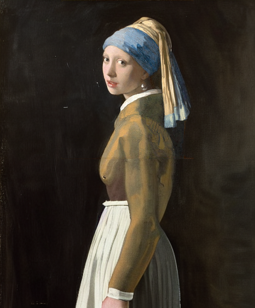

# ImaginAIry 🤖🧠

[](https://colab.research.google.com/drive/1rOvQNs0Cmn_yU1bKWjCOHzGVDgZkaTtO?usp=sharing)
[](https://pepy.tech/project/imaginairy)
[](https://pypi.org/project/imaginairy/)
[](https://github.com/brycedrennan/imaginAIry/blob/master/LICENSE/)
[](https://github.com/ambv/black)
[](https://github.com/brycedrennan/imaginAIry/actions/workflows/ci.yaml)

AI imagined images. Pythonic generation of stable diffusion images.

"just works" on Linux and macOS(M1) (and maybe windows?).


```bash
# on macOS, make sure rust is installed first
>> pip install imaginairy
>> imagine "a scenic landscape" "a photo of a dog" "photo of a fruit bowl" "portrait photo of a freckled woman" "a bluejay"
# Make an animation showing the generation process
>> imagine --gif "a flower"
```
<p float="left">


</p>

### Image Structure Control [by ControlNet](https://github.com/lllyasviel/ControlNet)
Generate images guided by body poses, depth maps, canny edges, hed boundaries, or normal maps.

**Openpose Control**

```bash
imagine --control-image assets/indiana.jpg  --control-mode openpose --caption-text openpose "photo of a polar bear"
```

<p float="left">
    
    
    
</p>

**Canny Edge Control**

```bash
imagine --control-image assets/lena.png  --control-mode canny "photo of a woman with a hat looking at the camera"
```

<p float="left">
    
    
    
</p>

**HED Boundary Control**

```bash
imagine --control-image dog.jpg  --control-mode hed  "photo of a dalmation"
```

<p float="left">
    
    
    
</p>

**Depth Map Control**

```bash
imagine --control-image fancy-living.jpg  --control-mode depth  "a modern living room"
```

<p float="left">
    
    
    
</p>

**Normal Map Control**

```bash
imagine --control-image bird.jpg  --control-mode normal  "a bird"
```

<p float="left">
    
    
    
</p>


###  Instruction based image edits [by InstructPix2Pix](https://github.com/timothybrooks/instruct-pix2pix)
Just tell imaginairy how to edit the image and it will do it for you!
<p float="left">


</p>

<details>
<summary>Click to see shell commands</summary>
Use prompt strength to control how strong the edit is. For extra control you can combine with prompt-based masking.

```bash
# enter imaginairy shell
>> aimg
🤖🧠> edit scenic_landscape.jpg -p "make it winter" --prompt-strength 20
🤖🧠> edit dog.jpg -p "make the dog red" --prompt-strength 5
🤖🧠> edit bowl_of_fruit.jpg -p "replace the fruit with strawberries"
🤖🧠> edit freckled_woman.jpg -p "make her a cyborg" --prompt-strength 13
🤖🧠> edit bluebird.jpg -p "make the bird wear a cowboy hat" --prompt-strength 10
🤖🧠> edit flower.jpg -p "make the flower out of paper origami" --arg-schedule prompt-strength[1:11:0.3]  --steps 25 --compilation-anim gif

# create a comparison gif
🤖🧠> edit pearl_girl.jpg -p "make her wear clown makeup" --compare-gif
# create an animation showing the edit with increasing prompt strengths
🤖🧠> edit mona-lisa.jpg -p "make it a color professional photo headshot" --negative-prompt "old, ugly, blurry" --arg-schedule "prompt-strength[2:8:0.5]" --compilation-anim gif
🤖🧠> edit gg-bridge.jpg -p "make it night time" --prompt-strength 15  --steps 30 --arg-schedule prompt-strength[1:15:1] --compilation-anim gif
```
</details>


### Quick Image Edit Demo
Want just quickly have some fun? Try `edit-demo` to apply some pre-defined edits.
```bash
>> aimg edit-demo pearl_girl.jpg
```
<p float="left">


</p>


### Prompt Based Masking  [by clipseg](https://github.com/timojl/clipseg)
Specify advanced text based masks using boolean logic and strength modifiers. 
Mask syntax:
  - mask descriptions must be lowercase
  - keywords (`AND`, `OR`, `NOT`) must be uppercase
  - parentheses are supported 
  - mask modifiers may be appended to any mask or group of masks.  Example: `(dog OR cat){+5}` means that we'll
select any dog or cat and then expand the size of the mask area by 5 pixels.  Valid mask modifiers:
    - `{+n}` - expand mask by n pixels
    - `{-n}` - shrink mask by n pixels
    - `{*n}` - multiply mask strength. will expand mask to areas that weakly matched the mask description
    - `{/n}` - divide mask strength. will reduce mask to areas that most strongly matched the mask description. probably not useful

When writing strength modifiers keep in mind that pixel values are between 0 and 1.

```bash
>> imagine \
    --init-image pearl_earring.jpg \
    --mask-prompt "face AND NOT (bandana OR hair OR blue fabric){*6}" \
    --mask-mode keep \
    --init-image-strength .2 \
    --fix-faces \
    "a modern female president" "a female robot" "a female doctor" "a female firefighter"
```
➡️ 


```bash
>> imagine \
    --init-image fruit-bowl.jpg \
    --mask-prompt "fruit OR fruit stem{*6}" \
    --mask-mode replace \
    --mask-modify-original \
    --init-image-strength .1 \
    "a bowl of kittens" "a bowl of gold coins" "a bowl of popcorn" "a bowl of spaghetti"
```
➡️ 


### Face Enhancement [by CodeFormer](https://github.com/sczhou/CodeFormer)

```bash
>> imagine "a couple smiling" --steps 40 --seed 1 --fix-faces
```
 ➡️ 
 


### Upscaling [by RealESRGAN](https://github.com/xinntao/Real-ESRGAN)
```bash
>> imagine "colorful smoke" --steps 40 --upscale
# upscale an existing image
>> aimg upscale my-image.jpg
```
 ➡️ 
 

### Tiled Images
```bash
>> imagine  "gold coins" "a lush forest" "piles of old books" leaves --tile
```


<br>


#### 360 degree images
```bash
imagine --tile-x -w 1024 -h 512 "360 degree equirectangular panorama photograph of the desert"  --upscale
```


### Image-to-Image
Use depth maps for amazing "translations" of existing images.

```bash
>> imagine --model SD-2.0-depth --init-image girl_with_a_pearl_earring_large.jpg --init-image-strength 0.05  "professional headshot photo of a woman with a pearl earring" -r 4 -w 1024 -h 1024 --steps 50
```
<p float="left">
 ➡️ 


</p>


### Outpainting

Given a starting image, one can generate it's "surroundings".

Example:
`imagine --init-image pearl-earring.jpg --init-image-strength 0 --outpaint all250,up0,down600 "woman standing"`

 ➡️ 


### Work with different generation models

<p float="left">
    
    
    
    
    
    
</p>

<details>
<summary>Click to see shell command</summary>

```bash
imagine "valley, fairytale treehouse village covered, , matte painting, highly detailed, dynamic lighting, cinematic, realism, realistic, photo real, sunset, detailed, high contrast, denoised, centered, michael whelan" --steps 60 --seed 1 --arg-schedule model[sd14,sd15,sd20,sd21,openjourney-v1,openjourney-v2] --arg-schedule "caption-text[sd14,sd15,sd20,sd21,openjourney-v1,openjourney-v2]"
```
</details>

### Prompt Expansion
You can use `{}` to randomly pull values from lists.  A list of values separated by `|` 
 and enclosed in `{ }` will be randomly drawn from in a non-repeating fashion. Values that are surrounded by `_ _` will 
 pull from a phrase list of the same name.   Folders containing .txt phraselist files may be specified via
`--prompt_library_path`. The option may be specified multiple times.  Built-in categories:
    
      3d-term, adj-architecture, adj-beauty, adj-detailed, adj-emotion, adj-general, adj-horror, animal, art-scene, art-movement, 
      art-site, artist, artist-botanical, artist-surreal, aspect-ratio, bird, body-of-water, body-pose, camera-brand,
      camera-model, color, cosmic-galaxy, cosmic-nebula, cosmic-star, cosmic-term, desktop-background, dinosaur, eyecolor, f-stop, 
      fantasy-creature, fantasy-setting, fish, flower, focal-length, food, fruit, games, gen-modifier, hair, hd,
      iso-stop, landscape-type, national-park, nationality, neg-weight, noun-beauty, noun-fantasy, noun-general, 
      noun-horror, occupation, painting-style, photo-term, pop-culture, pop-location, punk-style, quantity, rpg-item, scenario-desc, 
      skin-color, spaceship, style, tree-species, trippy, world-heritage-site

   Examples:

   `imagine "a {lime|blue|silver|aqua} colored dog" -r 4 --seed 0` (note that it generates a dog of each color without repetition)


   `imagine "a {_color_} dog" -r 4 --seed 0` will generate four, different colored dogs. The colors will be pulled from an included 
   phraselist of colors.
    
   `imagine "a {_spaceship_|_fruit_|hot air balloon}. low-poly" -r 4 --seed 0` will generate images of spaceships or fruits or a hot air balloon

   Credit to [noodle-soup-prompts](https://github.com/WASasquatch/noodle-soup-prompts/) where most, but not all, of the wordlists originate.

### Generate image captions (via [BLIP](https://github.com/salesforce/BLIP))
```bash
>> aimg describe assets/mask_examples/bowl001.jpg
a bowl full of gold bars sitting on a table
```

### Example Use Cases

```bash
>> aimg
# Generate endless 8k art
🤖🧠> imagine -w 1920 -h 1080 --upscale "{_art-scene_}. {_painting-style_} by {_artist_}" -r 1000 --steps 30 --model sd21v

# generate endless desktop backgrounds 
🤖🧠> imagine --tile "{_desktop-background_}" -r 100

# convert a folder of images to pencil sketches
🤖🧠> edit other/images/*.jpg -p "make it a pencil sketch"

# upscale a folder of images
🤖🧠> upscale my-images/*.jpg

# generate kitchen remodel ideas
🤖🧠> imagine --control-image kitchen.jpg -w 1024 -h 1024 "{_interior-style_} kitchen" --control-mode depth -r 100 --init-image 0.01 --upscale --steps 35 --caption-text "{prompt}"
```

### Additional Features
 - Generate images either in code or from command line.
 - It just works. Proper requirements are installed. Model weights are automatically downloaded. No huggingface account needed. 
    (if you have the right hardware... and aren't on windows)
 - Noisy logs are gone (which was surprisingly hard to accomplish)
 - WeightedPrompts let you smash together separate prompts (cat-dog)
 - Prompt metadata saved into image file metadata
 - Have AI generate captions for images `aimg describe <filename-or-url>`
 - Interactive prompt: just run `aimg`
 - finetune your own image model. kind of like dreambooth. Read instructions on ["Concept Training"](docs/concept-training.md) page

## How To

For full command line instructions run `aimg --help`

```python
from imaginairy import imagine, imagine_image_files, ImaginePrompt, WeightedPrompt, LazyLoadingImage

url = "https://upload.wikimedia.org/wikipedia/commons/thumb/6/6c/Thomas_Cole_-_Architect%E2%80%99s_Dream_-_Google_Art_Project.jpg/540px-Thomas_Cole_-_Architect%E2%80%99s_Dream_-_Google_Art_Project.jpg"
prompts = [
    ImaginePrompt("a scenic landscape", seed=1, upscale=True),
    ImaginePrompt("a bowl of fruit"),
    ImaginePrompt([
        WeightedPrompt("cat", weight=1),
        WeightedPrompt("dog", weight=1),
    ]),
    ImaginePrompt(
        "a spacious building", 
        init_image=LazyLoadingImage(url=url)
    ),
    ImaginePrompt(
        "a bowl of strawberries", 
        init_image=LazyLoadingImage(filepath="mypath/to/bowl_of_fruit.jpg"),
        mask_prompt="fruit OR stem{*2}",  # amplify the stem mask x2
        mask_mode="replace",
        mask_modify_original=True,
    ),
    ImaginePrompt("strawberries", tile_mode=True),
]
for result in imagine(prompts):
    # do something
    result.save("my_image.jpg")

# or

imagine_image_files(prompts, outdir="./my-art")

```

## Requirements
- ~10 gb space for models to download
- A CUDA supported graphics card with >= 11gb VRAM (and CUDA installed) or an M1 processor.
- Python installed. Preferably Python 3.10.  (not conda)
- For macOS [rust](https://www.rust-lang.org/tools/install) and setuptools-rust must be installed to compile the `tokenizer` library.
They can be installed via: `curl --proto '=https' --tlsv1.2 -sSf https://sh.rustup.rs | sh` and `pip install setuptools-rust`
    

## Running in Docker
See example Dockerfile (works on machine where you can pass the gpu into the container)
```bash
docker build . -t imaginairy
# you really want to map the cache or you end up wasting a lot of time and space redownloading the model weights
docker run -it --gpus all -v $HOME/.cache/huggingface:/root/.cache/huggingface -v $HOME/.cache/torch:/root/.cache/torch -v `pwd`/outputs:/outputs imaginairy /bin/bash
```

## Running on Google Colab
[Example Colab](https://colab.research.google.com/drive/1rOvQNs0Cmn_yU1bKWjCOHzGVDgZkaTtO?usp=sharing)

## Q&A

**Q**: How do I change the cache directory for where models are stored?

**A**: Set the `HUGGINGFACE_HUB_CACHE` environment variable. 


## ChangeLog

- fix: filenames start numbers after latest image, even if some previous images were deleted

**11.1.1**
- fix: fix globbing bug with input image path handling
- fix: changed sample to True to generate caption using blip model

**11.1.0**

- docs: add some example use cases
- feature: add art-scene, desktop-background, interior-style, painting-style phraselists
- fix: compilation animations create normal slideshows instead of "bounces"
- fix: file globbing works in the interactive shell
- fix: fix model downloads that were broken by [library change in transformers 4.27.0](https://github.com/huggingface/transformers/commit/8f3b4a1d5bd97045541c43179efe8cd9c58adb76)

**11.0.0**
- all these changes together mean same seed/sampler will not be guaranteed to produce same image (thus the version bump)
- fix: image composition didn't work very well. Works well now but probably very slow on non-cuda platforms
- fix: remove upscaler tiling message
- fix: improve k-diffusion sampler schedule. significantly improves image quality of default sampler
- fix: img2img was broken for all samplers except plms and ddim when init image strength was >~0.25

**10.2.0**
 - feature: input raw control images (a pose, canny map, depth map, etc) directly using `--control-image-raw`
   This is opposed to current behavior of extracting the control signal from an input image via `--control-image`
 - feature: `aimg model-list` command lists included models
 - feature: system memory added to `aimg system-info` command
 - feature: add `--fix-faces` options to `aimg upscale` command
 - fix: add missing metadata attributes to generated images
 - fix: image composition step was producing unnecessarily blurry images 
 - refactor: split `aimg` cli code into multiple files
 - docs: pypi docs now link properly to github automatically

**10.1.0**
- feature: 🎉 ControlNet integration!  Control the structure of generated images.
- feature: `aimg colorize` attempts to use controlnet to colorize images
- feature: `--caption-text` command adds text at the bottom left of an image

**10.0.1**
- fix: `edit` was broken

**10.0.0**

- feature: 🎉🎉 Make large images while retaining composition. Try `imagine "a flower" -w 1920 -h 1080`
- fix: create compilations directory automatically
- perf: sliced encoding of images to latents (removes memory bottleneck)
- perf: use Silu for performance improvement over nonlinearity
- perf: `xformers` added as a dependency for linux and windows.  Gives a nice speed boost.
- perf: sliced attention now runs on MacOS. A typo prevented that from happening previously.
- perf: sliced latent decoding - now possible to make much bigger images. 3310x3310 on 11 GB GPU.

**9.0.2**
- fix: edit interface was broken

**9.0.1**
- fix: use entry_points for windows since setup.py scripts doesn't work on windows [#239](https://github.com/brycedrennan/imaginAIry/issues/239)

**9.0.0**

- perf: cli now has minimal overhead such that `aimg --help` runs in ~650ms instead of ~3400ms
- feature: `edit` and `imagine` commands now accept multiple images (which they will process separately).  This allows 
batch editing of images as requested in [#229](https://github.com/brycedrennan/imaginAIry/issues/229)
- refactor: move `--surprise-me` to its own subcommand `edit-demo`
- feature: allow selection of output image format with `--output-file-extension`
- docs: make training fail on MPS platform with useful error message
- docs: add directions on how to change model cache path

**8.3.1**
- fix: init-image-strength type

**8.3.0**
- feature: create `gifs` or `mp4s` from any images made in a single run with `--compilation-anim gif`
- feature: create a series of images or edits by iterating over a parameter with the `--arg-schedule` argument
- feature: `openjourney-v1` and `openjourney-v2` models added. available via `--model openjourney-v2`
- feature: add upscale command line function: `aimg upscale`
- feature: `--gif` option will create a gif showing the generation process for a single image
- feature: `--compare-gif` option will create a comparison gif for any image edits
- fix: tile mode was broken since latest perf improvements

**8.2.0**
- feature: added `aimg system-info` command to help debug issues

**8.1.0**
- feature: some memory optimizations and documentation
- feature: surprise-me improvements
- feature: image sizes can now be multiples of 8 instead of 64. Inputs will be silently rounded down.
- feature: cleaned up `aimg` shell logs  
- feature: auto-regen for unsafe images
- fix: make blip filename windows compatible
- fix: make captioning work with alpha pngs
 
**8.0.5**
- fix: bypass huggingface cache retrieval bug

**8.0.4**
- fix: limit attention slice size on MacOS machines with 64gb (#175)

**8.0.3**
- fix: use python 3.7 compatible lru_cache
- fix: use windows compatible filenames

**8.0.2**
- fix: hf_hub_download() got an unexpected keyword argument 'token'

**8.0.1**
- fix: spelling mistake of "surprise"

**8.0.0**
- feature: 🎉 edit images with instructions alone!
- feature: when editing an image add `--gif` to create a comparision gif
- feature: `aimg edit --surprise-me --gif my-image.jpg` for some fun pre-programmed edits
- feature: prune-ckpt command also removes the non-ema weights

**7.6.0**
- fix: default model config was broken
- feature: print version with `--version`
- feature: ability to load safetensors
- feature:  🎉 outpainting. Examples: `--outpaint up10,down300,left50,right50` or `--outpaint all100` or `--outpaint u100,d200,l300,r400`

**7.4.3**
- fix: handle old pytorch lightning imports with a graceful failure (fixes #161)
- fix: handle failed image generations better (fixes #83)

**7.4.2**
- fix: run face enhancement on GPU for 10x speedup

**7.4.1**
- fix: incorrect config files being used for non-1.0 models

**7.4.0**
- feature: 🎉 finetune your own image model. kind of like dreambooth. Read instructions on ["Concept Training"](docs/concept-training.md) page
- feature: image prep command. crops to face or other interesting parts of photo
- fix: back-compat for hf_hub_download
- feature: add prune-ckpt command
- feature: allow specification of model config file

**7.3.0**
- feature: 🎉 depth-based image-to-image generations (and inpainting) 
- fix: k_euler_a produces more consistent images per seed (randomization respects the seed again)

**7.2.0**
- feature: 🎉 tile in a single dimension ("x" or "y").  This enables, with a bit of luck, generation of 360 VR images.
Try this for example: `imagine --tile-x -w 1024 -h 512 "360 degree equirectangular panorama photograph of the mountains"  --upscale`

**7.1.1**
- fix: memory/speed regression introduced in 6.1.0
- fix: model switching now clears memory better, thus avoiding out of memory errors

**7.1.0**
- feature: 🎉 Stable Diffusion 2.1.  Generated people are no longer (completely) distorted. 
Use with `--model SD-2.1` or `--model SD-2.0-v` 

**7.0.0**
- feature: negative prompting.  `--negative-prompt` or `ImaginePrompt(..., negative_prompt="ugly, deformed, extra arms, etc")`
- feature: a default negative prompt is added to all generations. Images in SD-2.0 don't look bad anymore. Images in 1.5 look improved as well.

**6.1.2**
- fix: add back in memory-efficient algorithms

**6.1.1**
- feature: xformers will be used if available (for faster generation)
- fix: version metadata was broken

**6.1.0**
- feature: use different default steps and image sizes depending on sampler and model selceted
- fix: #110 use proper version in image metadata
- refactor: samplers all have their own class that inherits from ImageSampler
- feature: 🎉🎉🎉 Stable Diffusion 2.0
  - `--model SD-2.0` to use (it makes worse images than 1.5 though...) 
  - Tested on macOS and Linux
  - All samplers working for new 512x512 model
  - New inpainting model working
  - 768x768 model working for all samplers except PLMS (`--model SD-2.0-v `)

**5.1.0**
- feature: add progress image callback

**5.0.1**
- fix: support larger images on M1. Fixes #8
- fix: support CPU generation by disabling autocast on CPU. Fixes #81

**5.0.0**
- feature: 🎉 inpainting support using new inpainting model from RunwayML. It works really well! By default, the 
inpainting model will automatically be used for any image-masking task 
- feature: 🎉 new default sampler makes image generation more than twice as fast
- feature: added `DPM++ 2S a` and `DPM++ 2M` samplers.
- feature: improve progress image logging
- fix: fix bug with `--show-work`. fixes #84
- fix: add workaround for pytorch bug affecting macOS users using the new `DPM++ 2S a` and `DPM++ 2M` samplers.
- fix: add workaround for pytorch mps bug affecting `k_dpm_fast` sampler. fixes #75
- fix: larger image sizes now work on macOS. fixes #8

**4.1.0**
 - feature: allow dynamic switching between models/weights `--model SD-1.5` or `--model SD-1.4` or `--model path/my-custom-weights.ckpt`)
 - feature: log total progress when generating images (image X out of Y)

**4.0.0**
 - feature: stable diffusion 1.5 (slightly improved image quality)
 - feature: dilation and erosion of masks
 Previously the `+` and `-` characters in a mask (example: `face{+0.1}`) added to the grayscale value of any masked areas. This wasn't very useful. The new behavior is that the mask will expand or contract by the number of pixel specified. The technical terms for this are dilation and erosion.  This allows much greater control over the masked area.
 - feature: update k-diffusion samplers. add k_dpm_adaptive and k_dpm_fast
 - feature: img2img/inpainting supported on all samplers
 - refactor: consolidates img2img/txt2img code. consolidates schedules. consolidates masking
 - ci: minor logging improvements

**3.0.1**
 - fix: k-samplers were broken

**3.0.0**
 - feature: improved safety filter

**2.4.0**
 - 🎉 feature: prompt expansion
 - feature: make (blip) photo captions more descriptive

**2.3.1**
 - fix: face fidelity default was broken

**2.3.0**
 - feature: model weights file can be specified via `--model-weights-path` argument at the command line
 - fix: set face fidelity default back to old value
 - fix: handle small images without throwing exception. credit to @NiclasEriksen
 - docs: add setuptools-rust as dependency for macos 

**2.2.1**
 - fix: init image is fully ignored if init-image-strength = 0

**2.2.0**
 - feature: face enhancement fidelity is now configurable

**2.1.0**
 - [improved masking accuracy from clipseg](https://github.com/timojl/clipseg/issues/8#issuecomment-1259150865)

**2.0.3**
 - fix memory leak in face enhancer
 - fix blurry inpainting 
 - fix for pillow compatibility

**2.0.0**
 - 🎉 fix: inpainted areas correlate with surrounding image, even at 100% generation strength.  Previously if the generation strength was high enough the generated image
would be uncorrelated to the rest of the surrounding image.  It created terrible looking images.   
 - 🎉 feature: interactive prompt added. access by running `aimg`
 - 🎉 feature: Specify advanced text based masks using boolean logic and strength modifiers. Mask descriptions must be lowercase. Keywords uppercase.
   Valid symbols: `AND`, `OR`, `NOT`, `()`, and mask strength modifier `{+0.1}` where `+` can be any of `+ - * /`. Single character boolean operators also work (`|`, `&`, `!`)
 - 🎉 feature: apply mask edits to original files with `mask_modify_original` (on by default)
 - feature: auto-rotate images if exif data specifies to do so
 - fix: mask boundaries are more accurate
 - fix: accept mask images in command line
 - fix: img2img algorithm was wrong and wouldn't at values close to 0 or 1

**1.6.2**
 - fix: another bfloat16 fix

**1.6.1**
 - fix: make sure image tensors come to the CPU as float32 so there aren't compatibility issues with non-bfloat16 cpus

**1.6.0**
 - fix: *maybe* address #13 with `expected scalar type BFloat16 but found Float`
   - at minimum one can specify `--precision full` now and that will probably fix the issue  
 - feature: tile mode can now be specified per-prompt

**1.5.3**
 - fix: missing config file for describe feature

**1.5.1**
 - img2img now supported with PLMS (instead of just DDIM)
 - added image captioning feature `aimg describe dog.jpg` => `a brown dog sitting on grass`
 - added new commandline tool `aimg` for additional image manipulation functionality

**1.4.0**
 - support multiple additive targets for masking with `|` symbol.  Example: "fruit|stem|fruit stem"

**1.3.0**
 - added prompt based image editing. Example: "fruit => gold coins"
 - test coverage improved

**1.2.0**
 - allow urls as init-images

**previous**
 - img2img actually does # of steps you specify  
 - performance optimizations
 - numerous other changes


## Not Supported
 - a GUI. this is a python library
 - exploratory features that don't work well


