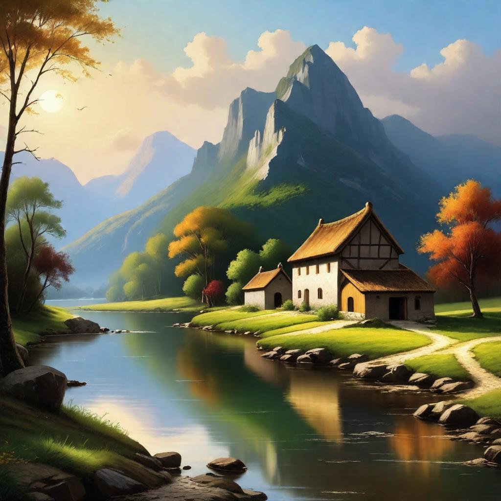
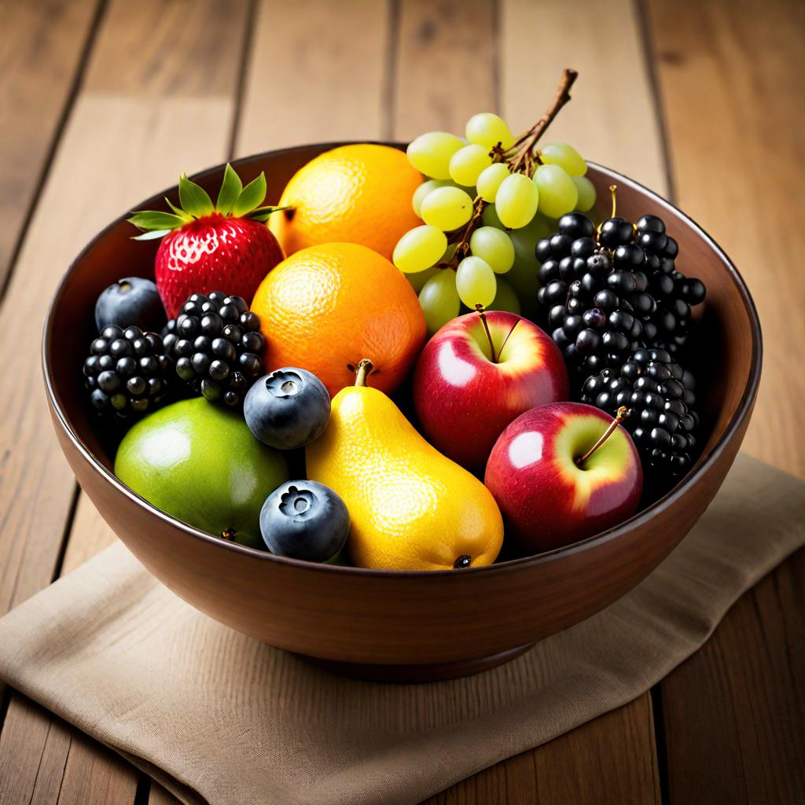
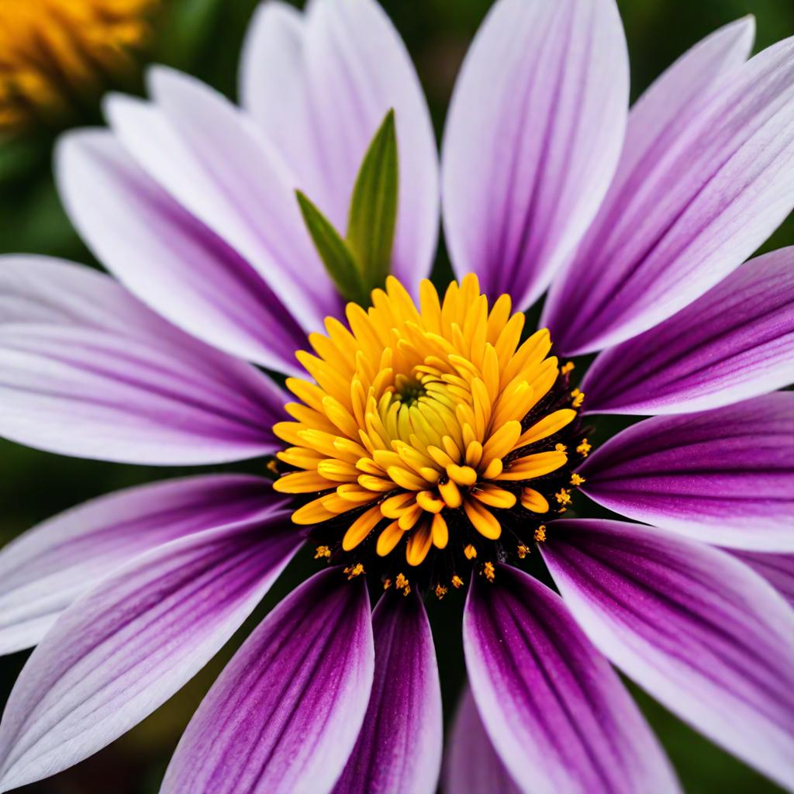
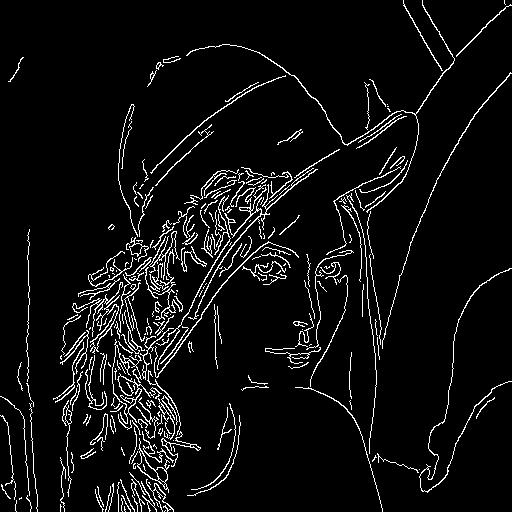
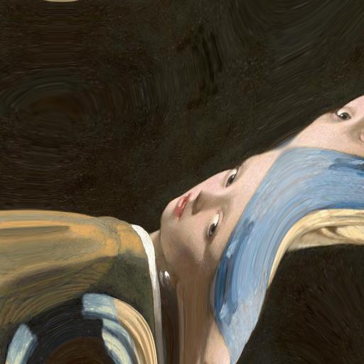
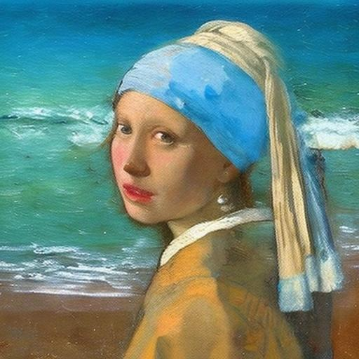

# ImaginAIry 🤖🧠
**Pythonic AI generation of images and videos**

[](https://pepy.tech/project/imaginairy)
[](https://pypi.org/project/imaginairy/)
[](https://github.com/brycedrennan/imaginAIry/blob/master/LICENSE/)
[](https://discord.gg/FdD7ut3YjW)

<p float="left">






</p>

## Features

- [Image Generation](#image-generation): Create with SDXL, Openjourney, OpenDalle, and many others.
    - [Generation Control](#image-generation-control): Exert detailed control over the generation process.
- [Image Editing](#editing-instructions-control): Edit images with instructions.
- [Image Upscaling](#add-details-control-upscalingsuper-resolution): Add details to images.
- [Video Generation](#video-generation): Turn images into videos.
- **Image Captioning**: 
---

## Installation

```bash
# on macOS, make sure rust is installed first
# be sure to use Python 3.10, Python 3.11 is not supported at the moment
pip install imaginairy

```

---


## Image Generation

=== "CLI"
    ```bash
    aimg imagine --seed 1 --model sdxl --size hd "wide shot of sun setting on a green valley"
    ```

=== "Python"
    ``` py
    from imaginairy.api.generate import imagine
    from imaginairy.schema import ImaginePrompt

    prompt = ImaginePrompt(
        prompt="wide shot of sun setting on a green valley", 
        seed=1, 
        model_weights="sdxl", 
        size="hd"
    )

    result = next(imagine(prompts=prompt))
    result.img.save("sun_set_green_valley.png")
    ```


---

### Image Generation Control
Guide the generation process by providing body poses, depth maps, canny edges, hed boundaries, normal maps, or even QR codes.

#### Body Pose Control

=== "CLI"
    ```bash
    imagine --control-image assets/indiana.jpg  --control-mode openpose --caption-text openpose "photo of a polar bear"
    ```

=== "Python"
    ``` py
    from imaginairy.api.generate import imagine
    from imaginairy.schema import ImaginePrompt, ControlInput, LazyLoadingImage

    image = LazyLoadingImage(filepath="assets/indiana.jpg")
    control_mode = ControlInput(mode="openpose", image=image)
    prompt = ImaginePrompt(prompt="photo of a polar bear", control_inputs=[control_mode], seed=1)

    result = next(imagine(prompts=prompt))
    result.img.save("assets/indiana-pose-polar-bear.jpg")
    ```

<p float="left">
    
    
    
</p>

#### Canny Edge Control
=== "CLI"

    ```bash
    imagine --control-image assets/lena.png  --control-mode canny "photo of a woman with a hat looking at the camera"
    ```

=== "Python"
    ``` py
    from imaginairy.api.generate import imagine
    from imaginairy.schema import ImaginePrompt, ControlInput, LazyLoadingImage

    image = LazyLoadingImage(filepath="assets/lena.png")
    control_mode = ControlInput(mode="canny", image=image)
    prompt = ImaginePrompt(prompt="photo of a woman with a hat looking at the camera", control_inputs=[control_mode], seed=1)

    result = next(imagine(prompts=prompt))
    result.img.save("assets/lena-canny-generated.jpg")
    ```


<p float="left">
    
    
    
</p>

#### HED Boundary Control

=== "CLI"
    ```bash
    imagine --control-image dog.jpg  --control-mode hed  "photo of a dalmation"
    ```

=== "Python"
    ``` py
    from imaginairy.api.generate import imagine
    from imaginairy.schema import ImaginePrompt, ControlInput, LazyLoadingImage

    image = LazyLoadingImage(filepath="assets/000032_337692011_PLMS40_PS7.5_a_photo_of_a_dog.jpg")
    control_mode = ControlInput(mode="hed", image=image)
    prompt = ImaginePrompt(prompt="photo of a dalmation", control_inputs=[control_mode], seed=1)

    result = next(imagine(prompts=prompt))
    result.img.save("assets/dog-hed-boundary-dalmation.jpg")
    ```

<p float="left">
    
    
    
</p>

#### Depth Map Control
=== "CLI"
    ```bash
    imagine --control-image fancy-living.jpg  --control-mode depth  "a modern living room"
    ```

=== "Python"
    ``` py
    from imaginairy.api.generate import imagine
    from imaginairy.schema import ImaginePrompt, ControlInput, LazyLoadingImage

    image = LazyLoadingImage(filepath="assets/fancy-living.jpg")
    control_mode = ControlInput(mode="depth", image=image)
    prompt = ImaginePrompt(prompt="a modern living room", control_inputs=[control_mode], seed=1)

    result = next(imagine(prompts=prompt))
    result.img.save("assets/fancy-living-depth-generated.jpg")
    ```

<p float="left">
    
    
    
</p>

#### Normal Map Control
=== "CLI"
    ```bash
    imagine --control-image bird.jpg  --control-mode normal  "a bird"
    ```

=== "Python"
    ``` py
    from imaginairy.api.generate import imagine
    from imaginairy.schema import ImaginePrompt, ControlInput, LazyLoadingImage

    image = LazyLoadingImage(filepath="assets/013986_1_kdpmpp2m59_PS7.5_a_bluejay_[generated].jpg")
    control_mode = ControlInput(mode="normal", image=image)
    prompt = ImaginePrompt(prompt="a bird", control_inputs=[control_mode], seed=1)

    result = next(imagine(prompts=prompt))
    result.img.save("assets/bird-normal-generated.jpg")
    ```

<p float="left">
    
    
    
</p>

#### Image Shuffle Control

Generates the image based on elements of the control image. Kind of similar to style transfer.
=== "CLI"
    ```bash
    imagine --control-image pearl-girl.jpg  --control-mode shuffle  "a clown"
    ```

=== "Python"
    ``` py
    from imaginairy.api.generate import imagine
    from imaginairy.schema import ImaginePrompt, ControlInput, LazyLoadingImage

    image = LazyLoadingImage(filepath="assets/girl_with_a_pearl_earring.jpg")
    control_mode = ControlInput(mode="shuffle", image=image)
    prompt = ImaginePrompt(prompt="a clown", control_inputs=[control_mode], seed=1)

    result = next(imagine(prompts=prompt))
    result.img.save("assets/pearl_shuffle_clown_019331_1_kdpmpp2m15_PS7.5_img2img-0.0_a_clown.jpg")
    ```

The middle image is the "shuffled" input image
<p float="left">
    
    
    
</p>

#### Editing Instructions Control

Similar to instructPix2Pix (below) but works with any SD 1.5 based model.
=== "CLI"
    ```bash
    imagine --control-image pearl-girl.jpg  --control-mode edit --init-image-strength 0.01 --steps 30  --negative-prompt "" --model openjourney-v2 "make it anime" "make it at the beach" 
    ```

=== "Python"
    ``` py
    from imaginairy.api.generate import imagine
    from imaginairy.schema import ImaginePrompt, ControlInput, LazyLoadingImage

    image = LazyLoadingImage(filepath="assets/girl_with_a_pearl_earring.jpg")
    control_mode = ControlInput(mode="edit", image=image)

    prompts = [ImaginePrompt(prompt="make it anime", control_inputs=[control_mode], init_image_strength=0.01, steps=30, negative_prompt="", model_weights="openjourney-v2"),
                ImaginePrompt(prompt="make it at the beach", control_inputs=[control_mode], init_image_strength=0.01, steps=30, negative_prompt="", model_weights="openjourney-v2")]

    imagine_iterator = imagine(prompts=prompts)

    result = next(imagine_iterator)
    result.img.save("assets/pearl_anime_019537_521829407_kdpmpp2m30_PS9.0_img2img-0.01_make_it_anime.jpg")

    result = next(imagine_iterator)
    result.img.save("assets/pearl_beach_019561_862735879_kdpmpp2m30_PS7.0_img2img-0.01_make_it_at_the_beach.jpg")
    ```

<p float="left">
    
    
    
</p>

#### Add Details Control (upscaling/super-resolution)

Replaces existing details in an image. Good to use with --init-image-strength 0.2

=== "CLI"
    ```bash
    imagine --control-image "assets/wishbone.jpg" --control-mode details "sharp focus, high-resolution" --init-image-strength 0.2 --steps 30 --size 2048x2048 
    ```

=== "Python"
    ```py
    from imaginairy.api.generate import imagine
    from imaginairy.schema import ImaginePrompt, ControlInput, LazyLoadingImage

    image = LazyLoadingImage(filepath="assets/wishbone_headshot_badscale.jpg")
    control_mode = ControlInput(mode="details", image=image)
    prompt = ImaginePrompt(prompt="sharp focus, high-resolution", control_inputs=[control_mode], init_image_strength=0.2)

    result = next(imagine(prompts=prompt))
    result.img.save("assets/wishbone_headshot_details.jpg")
    ```

<p float="left">
    
    
</p>


## Image (re)Colorization (using brightness control)
Colorize black and white images or re-color existing images.

The generated colors will be applied back to the original image. You can either provide a caption or 
allow the tool to generate one for you.

=== "CLI"
    ```bash
    aimg colorize pearl-girl.jpg --caption "photo of a woman"
    ```
=== "Python"
    ``` py
    from imaginairy.api.colorize import colorize_img
    from PIL import Image, ImageEnhance, ImageStat

    init_image = Image.open("assets/girl_with_a_pearl_earring.jpg")
    image = colorize_img(img=init_image, caption="photo of a woman")
    image.save("assets/pearl-colorized.jpg")
    ```

<p float="left">
    
    
    
</p>


## Video Generation

=== "CLI"
    ```bash
    aimg videogen --start-image assets/rocket-wide.png
    ```

=== "Python"
    ```py
    from imaginairy.api.video_sample import generate_video

    generate_video(input_path="assets/rocket-wide.png")

    ```
